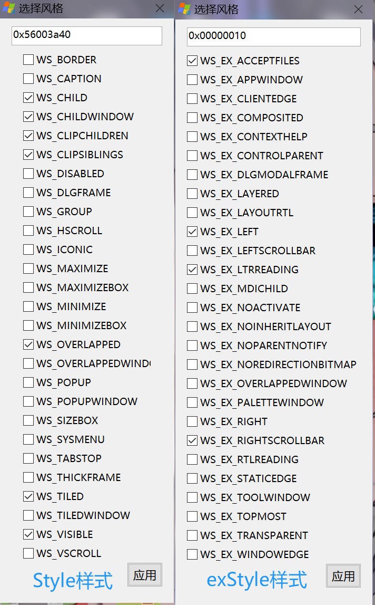

# Window's Handle(旧版 v1.2.0.0)
***Handle意味着把柄，一旦握住窗口的把柄就可以为所欲为了***
### 作者：[Bilibili - 个人隐思](https://space.bilibili.com/1081364881 "来我主页玩玩ヾ(^∀^)ﾉ")
### 爱发电主页：[ThinkAlone](https://afdian.com/a/X1415 "您赞助的每一分都是我前进的动力")
编程不易，打赏随意：

 
## 更新记录
- 1.2.1.0(2025.10.20)
  - 修复了因重启explorer导致托盘丢失的问题（感谢Github用户yuri368的issue）
  - 完善了自动规则中的窗口大小功能，现可以自定义最大化、最小化、隐藏而无需选中窗口大小复选框，右键复选框即可显示选项
- 1.2.0.0(2025.10.16)
  - 增加了**自动规则模式**，工具会根据您的设置条目，自动对新创建窗口进行对应修改<b>(Beta)</b>
  - 因为**实用性和兼容性**问题，暂时移除了**实例句柄**功能，用打印**目标进程的PID**功能替代
  - 修复了Win7下因**跨位数**导致目标进程路径获取失败的问题
  - 修复了选择指示框因意外丢失焦点导致出现**残留窗口**的问题
  - 添加了托盘选项，可以利用**配置文件**设置默认仅托盘模式，也可以用<b>"-tray"参数</b>运行本程序
  - 修复了弹出小号的子窗口**超出屏幕无法操作**的问题
  - 修复了窗口类名的**拼写错误**(Windows' Handle==>Window's Handle)
  - 优化部分参数和命名
- 1.1.0.0(2025.10.10)
  - 选择窗口时可以显示指示框了
  - 添加了"抖动"按钮右键功能，按照可以显示当前窗口的指示框
- 1.0.0.0(2025.10.7)
  - 正式版，基本实现稳定的功能

## 界面
### 主界面
 
### 窗口风格控制
 
### 枚举顶级窗口
 
### 枚举某个顶级窗口的所有子窗口/控件
 
### 发送消息
 
### 自动规则
 
#### 详细配置页
 

## 功能特点
- 纯Win32编程，最大程度保留兼容性，**甚至连XP都支持**（个别函数重编译）
- 大量方便的窗口操作，操作简单
- 支持**子窗口嵌套**操作，满足你的特殊需求
- 添加了**枚举**功能，就没有我找不到的窗口
- 支持对窗口**发送消息**，Win32开发者狂喜
- 支持**UIACCESS级置顶**，方便操作（需管理员权限）
- 支持**按规则修改窗口属性**，对于所有新建窗口都生效

## 视频介绍
[窗口把柄 - 1.2版本更新——自动规则](https://www.bilibili.com/video/BV1KFWzzFEeL/ "视频介绍")

# 祝你使用愉快:P
