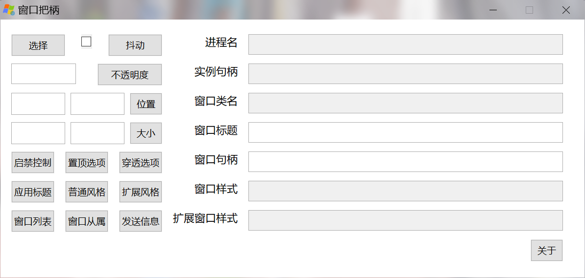
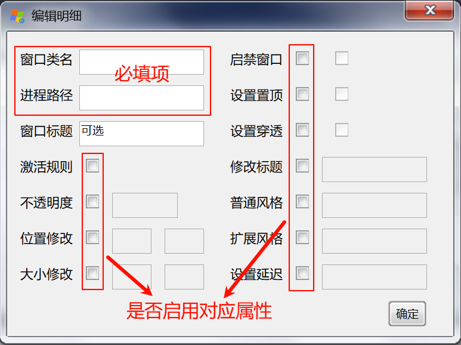

# Window's Handle(最新版 v1.4.0.0)
***Handle意味着把柄，一旦握住窗口的把柄就可以为所欲为了***
### 作者：[Bilibili - 个人隐思](https://space.bilibili.com/1081364881 "来我主页玩玩ヾ(^∀^)ﾉ")
### 爱发电主页：[ThinkAlone](https://afdian.com/a/X1415 "您赞助的每一分都是我前进的动力")
编程不易，打赏随意：

 
## 更新记录
- 1.4.0.0(2025.11.17)
  - 修复了快捷键移动和窗口修改窗口大小时，只拦截了左键和右键按下事件而没有拦截弹起事件的问题
  - 修复了因打开取消获取焦点功能，造成无法响应设置热键按键的问题（即设置热键界面强制获取焦点）
  - 修改了**不透明度设置**逻辑，对于无法修改不透明度的窗口将停用修改过程，防止显示错误
  - 修复了子窗口修改位置时**相对零点错误**
  - 修复了右键拖动“位置”按钮时，鼠标放不掉的问题！
  - 修复了自动规则删除一项时，相同窗口类名的条目**全部暂时失效**的问题
  - 窗口列表中的列表**默认按句柄排序**，不再是默认枚举乱序了
  - 新增了右键拖动“位置”按钮时，实时显示位置坐标
  - 新增了两个**窗口链**的查询入口，您可以快捷地查看任意窗口的父窗口链和拥有窗口链，同时移除了原本的窗口子窗口枚举（一起合并到窗口链表了）
  - 新增**窗口从属区分功能**，现在不仅仅是设置新父窗口(Parent)，还可以设置新拥有窗口(Owner)
  - 优化部分性能
  - 优化部分操作逻辑
- 1.3.0.0(2025.11.2)
  - 添加了**全局快捷键注册**功能
  - 优化了选择窗口功能
  - 优化了定时器部分参数
  - 完善了钩子机制，避免重复注册和注销
  - 优化了窗口风格窗口的代码，效率有略微的提升
  - 完善代码注释内容
  - 精简了部分消息机制
- 1.2.1.0(2025.10.20)
  - 修复了因重启explorer导致**托盘丢失**的问题<b>（感谢Github用户yuri368的issue）</b>
  - 完善了自动规则中的窗口大小功能，现可以**自定义**最大化、最小化、隐藏而无需选中窗口大小复选框，**右键复选框**即可显示选项
- 1.2.0.0(2025.10.16)
  - 增加了**自动规则模式**，工具会根据您的设置条目，自动对新创建窗口进行对应修改<b>(Beta)</b>
  - 因为**实用性和兼容性**问题，暂时移除了**实例句柄**功能，用打印**目标进程的PID**功能替代
  - 修复了Win7下因**跨位数**导致目标进程路径获取失败的问题
  - 修复了选择指示框因意外丢失焦点导致出现**残留窗口**的问题
  - 添加了托盘选项，可以利用**配置文件**设置默认仅托盘模式，也可以用<b>"-tray"参数</b>运行本程序
  - 修复了弹出小号的子窗口**超出屏幕无法操作**的问题
  - 修复了窗口类名的**拼写错误**(Windows' Handle==>Window's Handle)
  - 优化部分参数和命名
- 1.1.0.0(2025.10.10)
  - 选择窗口时可以显示指示框了
  - 添加了"抖动"按钮右键功能，按照可以显示当前窗口的指示框
- 1.0.0.0(2025.10.7)
  - 正式版，基本实现稳定的功能

## 界面
### 主界面
 
### 窗口风格控制
 
### 枚举顶级窗口
 
### 发送消息
 
### 自动规则
 
#### 详细配置页
 
### 设置快捷键
 
### 窗口链查询
 
### 设置窗口从属
 

## 功能特点
- **纯Win32**编程，最大程度保留兼容性，**甚至连XP都支持**（个别函数重编译）
- 大量方便的窗口操作，操作简单
- 支持**子窗口嵌套**操作，满足你的特殊需求
- 添加了**枚举**功能，就没有我找不到的窗口
- 支持对窗口**发送消息**，Win32开发者狂喜
- 支持**UIACCESS级置顶**，方便操作（需管理员权限）
- 支持**按规则修改窗口属性**，对于所有新建窗口都生效
- 支持利用**快捷键**对窗口做各种操作，简单快捷
- 快捷查询**窗口链**，从祖宗到重重孙子<s>，整个族谱都能扒出来（雾）</s>

## 视频介绍
[窗口把柄 - 1.4版本更新——窗口链查询](https://www.bilibili.com/video/BV1FkygB6EuQ/ "视频介绍")

# 祝你使用愉快:P
